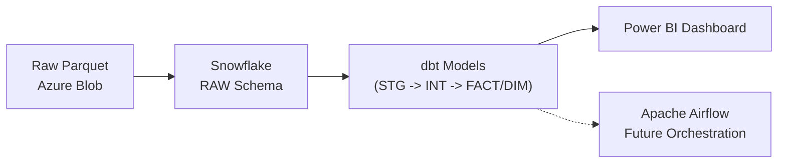
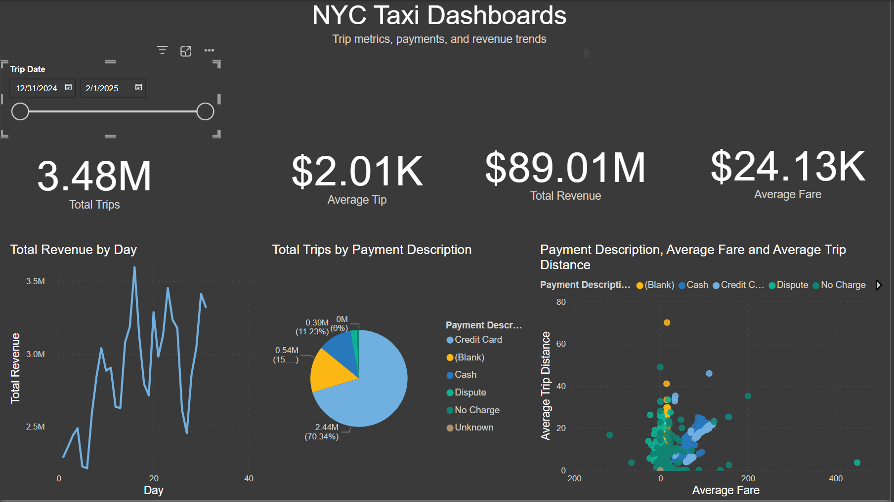

# NYC Taxi Trip Pipeline: From Ingestion to Dashboard

## Introduction

This project showcases an **end‑to‑end data engineering pipeline** built to process NYC Taxi Trip data — starting from raw files, moving through cloud storage and a data warehouse, applying dbt transformations, and finally visualizing insights in Power BI.

The goal is to demonstrate how different tools and services work together in a seamless workflow:

* Ingestion ➔ Azure Blob Storage
* Modeling ➔ Snowflake + dbt
* Visualization ➔ Power BI Dashboard

---

## What This Project Covers

- **Ingestion**: Uploading raw NYC Taxi Trip Parquet files into Azure Blob Storage.
- **Loading**: Creating Snowflake stages and loading raw files into the `raw` schema.
- **Modeling**: Using dbt to transform and clean data into analytics-ready tables.
- **Visualization**: Final metrics and KPIs built in Power BI from the modeled data.
- **Future**: Orchestration and scheduling with Apache Airflow.

---

## Architecture Diagram




---

## Directory Structure

```
nyc-taxi-pipeline/
├─ 📁 dags/                # Apache Airflow (Future)
├─ 📁 dashboard/           # Power BI .pbix files
├─ 📁 data/                # Source data files
├─ 📁 dbt_nyc_yellow/      # dbt project directory
├─ 📁 docker/              # Docker files
├─ 📁 scripts/             # Scripts for Azure Blob uploading
├─ 📁 logs/                # Logs for dbt, airflow
├─ .gitignore              # Excluding secrets
├─ requirements.txt        # Python dependencies
├─ README.md               # Project documentation
```

---

## Technologies

* **Python 3.9+**
* **Azure Blob Storage** (data lake for raw files)
* **Snowflake** (data warehouse for raw and modeled data)
* **dbt** (data modeling and testing framework)
* **Power BI** (dashboard and analytics)
* **Apache Airflow** (future workflow orchestration)

---

## Getting Started

### Prerequisites

* Azure Blob Storage account
* Snowflake account
* Python 3.9+
* dbt-core and dbt-snowflake installed
* Power BI for viewing the `.pbix` files
* `.env` files configured for Azure and Snowflake connections

---

### Install Dependencies

```bash
pip install -r requirements.txt
```

---

### Usage

#### 1️⃣ Ingest

Upload raw files (`yellow_tripdata_2025-01.parquet`) to Azure Blob:

```bash
python scripts/upload_to_blob.py
```

#### 2️⃣ Load

Load raw files from Azure Blob into Snowflake’s `raw` schema.

#### 3️⃣ Model

Run dbt transformations:

```bash
cd dbt_nyc_yellow
dbt run
```

#### 4️⃣ Visualize

Open the `.pbix` files in `dashboard/` to explore KPIs, trips, revenues, and more.

---

## Final Outcome

An end‑to‑end analytics solution where:
✅ Data moves reliably from Azure Blob ➔ Snowflake ➔ dbt ➔ Power BI.
✅ You can clearly trace every step from raw files ➔ clean analytics tables ➔ final dashboards.

---

## Final Dashboard

The results of this end‑to‑end pipeline are visualized in a Power BI Dashboard.  
It provides actionable insights and metrics for stakeholders, making it easy to understand taxi trip patterns, revenue trends, and operational KPIs.




> 💡 **Highlights:**  
> - **3.48M Total Trips** recorded within the selected time range  
> - **$89.01M Total Revenue**, giving a quick snapshot of earnings  
> - **$24.13K Average Fare** and **$2.01K Average Tip** per trip  
> - **Detailed Daily Trends**: Enables quick identification of revenue peaks and dips  
> - **Breakdown by Payment Method** (Credit Card, Cash, Dispute, No Charge, Unknown), allowing deep dives into customer behavior  
> - **Average Trip Distance vs Fare** for deeper operational insights


## Created By

**Rizky Zaqi Megantara**
[LinkedIn](https://www.linkedin.com/in/zaqi-megantara-4989ab2a2/) | [GitHub](https://github.com/zaqimegantara)

---

## Final Notes

With this project, you have a solid, reproducible example of **modern data engineering practices**:

* ✅ Clear data flow from ingestion ➔ warehouse ➔ analytics
* ✅ Fully version‑controlled dbt transformations
* ✅ Interactive dashboards for stakeholders
* ⏳ Scalability built‑in for future workflow automation

> Thanks for checking out this project!
> If you found it helpful, ⭐️ the repo and feel free to contribute.

---

